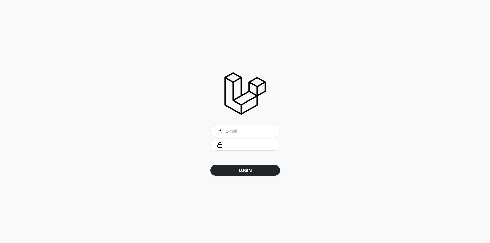

# Laravel Partners - CRUD
Teste de habilidades em Laravel com MySQL, Blade. CRUD de sócios e integração com ViaCEP API.

## Requisitos do teste:

- CRUD para gerenciar sócios (cada sócio deve ter informações como nome, tipo de sócio (silver ou gold) e endereço).
- Endereço preenchido automaticamente via integração com a API do ViaCEP ( [viacep.com.br](https://viacep.com.br) ).
- Sistema de autenticação para acesso ao CRUD.
- Sistema de templates Blade para renderizar as views.

## Visão geral
O projeto está "dockeirizado" numa stack LAMP (Linux, Apache, MySQL e PHP). Na verdade o banco utilizado dentro do container é o MariaDB 10.1.36, mas sobre MySQL e MariaDB estamos falando de praticamente a mesma coisa, visto que utilizam as mesmas APIs e recurso de gerenciamento de dados, além do fato de terem o mesmo criador. Dentro do container ainda tem o Node para gerenciamento de pacotes JS, mas não foi necessário nesse projeto.

## Principais tecnologias
- Laravel
- MariaDB

## Setup

Caso você tenha docker e docker compose instalados, o setup desse projeto será algo ridiculamente simples:

- Acessar a pasta raiz do projeto e rodar ```sh setup.sh```

Para não usuários de docker, eu imagino que as seguintes etapas devem ser feitas manualmente:

- Criação de um banco de dados chamado ```laravelapp```
- Criar o arquivo ```.env``` copiando e renomeando o arquivo```.env.example```
- Parametrizar as variáveis de banco com os dados do seu ambiente MySQL/MariaDB no arquivo ```.env```
- Rodar ```composer install```
- Rodar ```php artisan key:generate```
- Rodar ```php artisan migrate --seed```

O script ```setup.sh``` faz isso tudo por conta própria, mas é necessário ter o Docker instalado. Caso esse setup seja feito manualmente, será necessário ir vendo os erros de ambiente que acontecem e ir corrigindo, uma vez que apenas você sabe o que tem instalado na sua máquina e em quais portas e quais hosts estão parametrizados.

## Setup pronto com Docker
Como mencionado anteriormente, o que é necessário para fazer o setup com Docker, é rodar o comando ```sh setup.sh``` na raiz do projeto. Mas isso só deve ser feito quando for subir o projeto pela primeira vez para que a imagem e o container sejam criado. Das próximas vezes o comando ```sh start.sh``` pode ser executado para subir o container.

>>> Para parar o funcionamento do container com a aplicação, o comando ```sh stop.sh``` pode ser chamado.

Após rodar o comando ```sh setup.sh```, os seguintes serviços estarão disponíveis:

- ```MariaDB 10.1.36```
    - Porta HOST: ```5001```
    - Usuário: ```laravelapp```
    - Senha: ```laravelapp```

- ```Aplicação Laravel```
    - Endereço local: ```localhost:5000``` (não há nada para exibir no endpoint ```/```, acesse ```/login``` para acessar a tela de login)
    - Usuário: ```dev@laravel.com```
    - Senha: ```laravel```

Se tudo ocorreu bem e você acessou o endpoint ```/login```, esta tela será exibida:



Agora é só fazer o login utilizando as credenciais mencionadas anteriormente ou criar uma conta nova dentro do módulo "Usuários do sistema" já dentro do app.

# Documentação dos módulos existentes

- [Sócios](./docs/web/partners/index.md)
