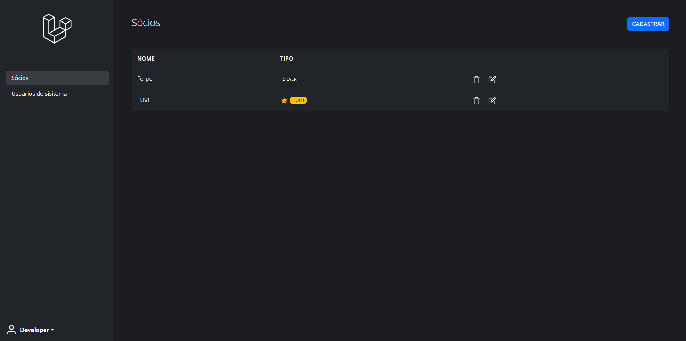
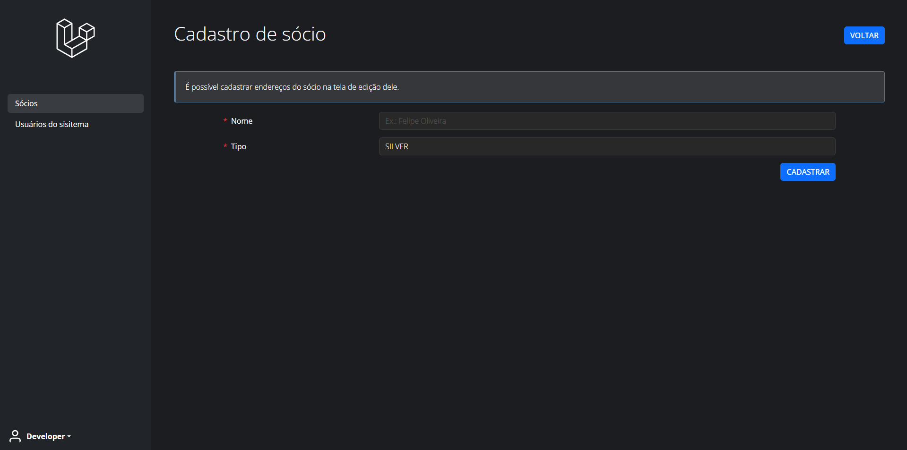
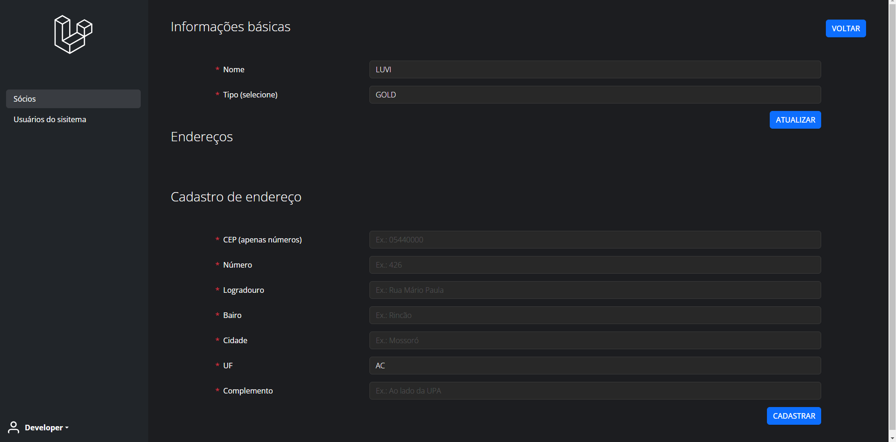
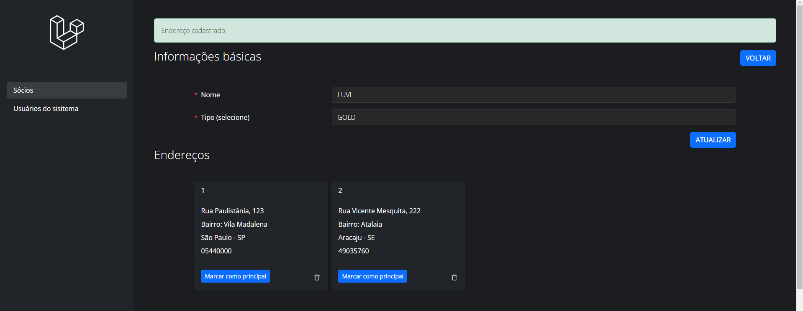
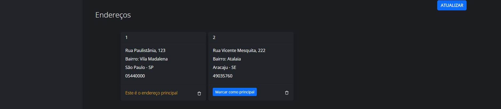

# Sócios


Um sócio pode ser classificado com duas labels: ```silver``` ou ```gold``` e pode ter cadastro de endereços associados a ele.
A listagem não tem segredo, é a listagem com dois botões de ação, deletar e editar.

Como é algo bem simples, algumas coisas foram feitas de forma simples também, como por exemplo ao clicar no botão de deletar (ícone de lixeira) um popup padrão do browser (```window.confirm```) perguntará se você tem certeza que quer continuar. A deleção se comporta da mesma maneira.

Na tela de cadastro, as únicas informações solicitadas são nome e tipo:


Esse alerta antes do formulário com a frase "É possível cadastrar endereços do sócio na tela de edição dele." me dá a oportunidade de falar como eu pensei e como é feito o cadastro de endereços do sócio.

Então assim que é finalizado o cadastro do sócio, você é direcionado para a tela de listagem e recebe uma mensagem de que deu tudo certo ou errado. Na tela de listagem, clicando no botão de edição (ícone de lápis) você será levado para a tela de edição obviamente e lá existem 3 partes:

- Edição dos dados básicos
- Visualização dos endereços cadastrados
- Formulário de cadastro de endereço



São 3 partes independentes umas das outras. O motivo de eu ter feito assim foi que achei que ficaria diferente, só isso. Achei que poderia evitar fazer um novo link de módulo no menu lateral e associar as informações do sócio em uma tela só.

# Informações básicas
Sobre a primeira parte, o formulário de atualização de dados básicos, não tem segredo, é a atualização do nome e tipo.


# Endereços
Nessa parte são listados os endereços do sócio. Um sócio pode ter mais de 1 endereço, sendo que um deles pode ser marcado como ```principal```. Marcar um endereço como principal é um plus que adicionei no projeto, que não faz parte dos requisitos.



Os endereços que não estão marcados como ```principal``` possuem um botão para efetuar essa ação. Quando clicado, o cenário é que será exibido uma marcação no endereço principal informando isso, e ele não terá o botão de marcação:



Não existe uma tela para edição do endereço. A deleção de endereço se comporta igual a deleção de sócio (um ```window.confirm```).


# Cadastro de endereço
No cadastro de endereço existe a integração com a API ViaCEP ([viacep.com.br](https://viacep.com.br)) para preenchimento automário dos dados de endereço.
Assim que finalizado a digitação dos 8 números do CEP, uma requisição será feita para a API e com a resposta, o preenchimento dos campos de logradouro, bairo, cidade e UF. O complemento deve ser preenchido pelo usuário se houver necessidade. O campo de número também deve ser preenchido pelo usuário visto que é uma informação que só ele sabe. A requisição na API é feita com JavaScript "puro" usando a fetch API. Em caso de resposta negativa da API ViaCEP, um ```window.alert``` informará que o preenchimento manual deve ser feito.
Existem validações no backend para evitar o cadastro de dados vazios ou incorretos.

[<<< Voltar](./../../../README.md)
